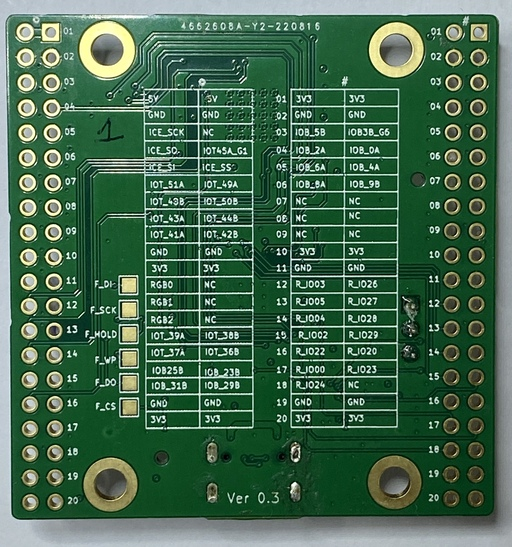
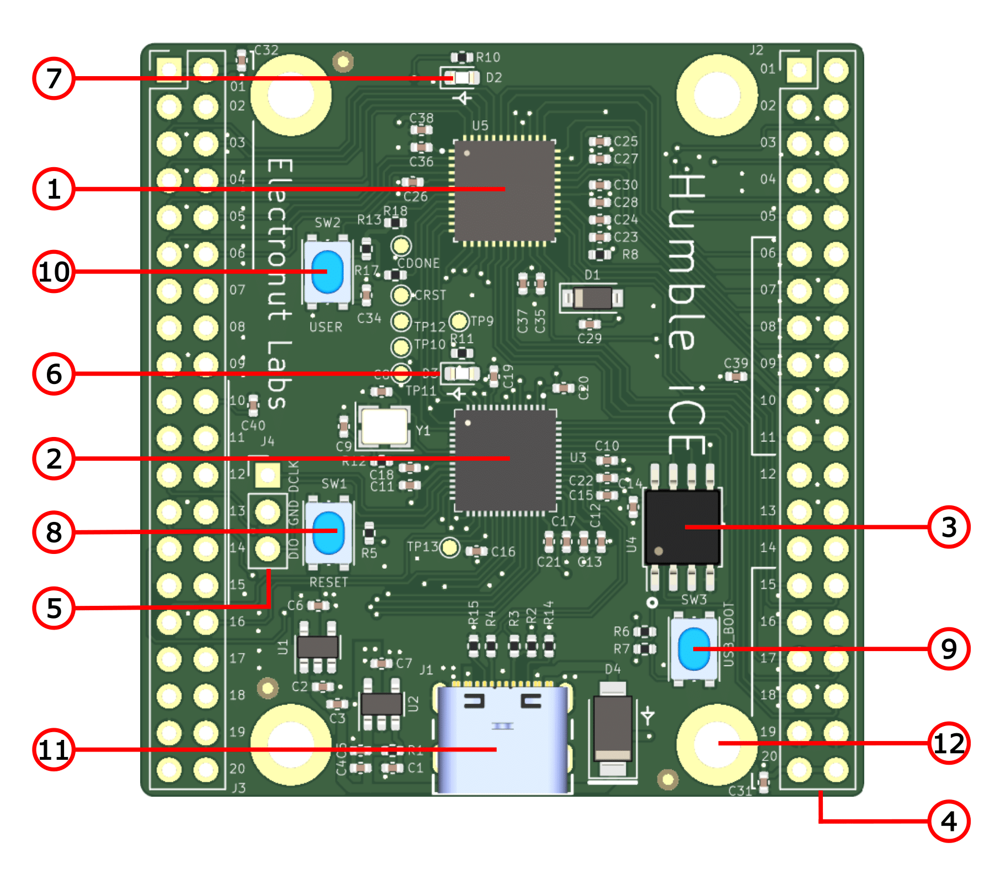
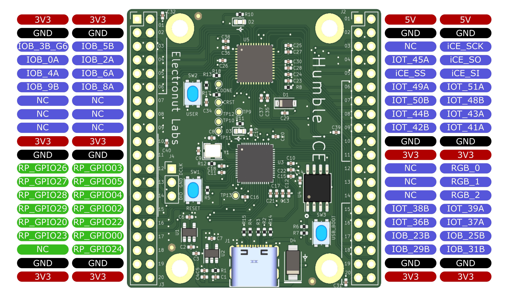

# Humble iCE 

Humble iCE is a low cost FPGA development board based on Lattice iCE40UP5k and 
Raspberry Pi RP2040. 

|Front |Back |
|---|---|
|| |

## Hardware 

1. Lattice Semiconductor iCE40UP5k FPGA 
2. Raspberry Pi RP2040
3. 32 Mb Flash
4. 2 x 2x20 2.54 mm headers (3 x PMOD iCE40, 1 x PMOD RP2040) 
5. RP2040 SWD (debug) header
6. 1 x Red LED RP2040
7. 1 x Blue LED iCE40
8. 1 push button reset
9. 1 push button RP boot 
10. 1 push button iCE40
11. USB Type-C connector
12. 4 x mounting holes

The schematic for the board can be found [here][1].

## Architecture 

The RP2040 serves as the bitstream uploader and communication bridge for iCE40. 
4 extra GPIO lines connect the two chips. In the default RP firmware, it exposes two CDC 
USB ports when plugged in. One is uses to send the bitstream from your computer 
using a Pythion script. The second port can be used to communicate with a UART 
module in FPGA fabric. RP receives the bistream and uploads it via SPI to the 
FPGA. To save costs, we're using SPI slave mode configuration for this board. 
The bitstream is saved in the flash. When the RP boots up, if it finds a 
bistream in the flash, it will upload it to iCE40 via SPI.

Another cost saving measure used in the board is to use the XTAL on RP2040 and 
*clk_gpout* to supply the clock for the iCE40.

There are more possibilities here - for instance, with custom RP firmware, you 
can use the iCE40 as a compute accelerator and transfer data back and forth 
via SPI using the 4 lines.

## Pinout

Here's the pinout for the board.

## Board dimensions

Here are the board dimensions for Humble iCE.

[1]: https://github.com/mkvenkit/humble_ice/blob/main/hi_schematic_v_0.3.pdf
