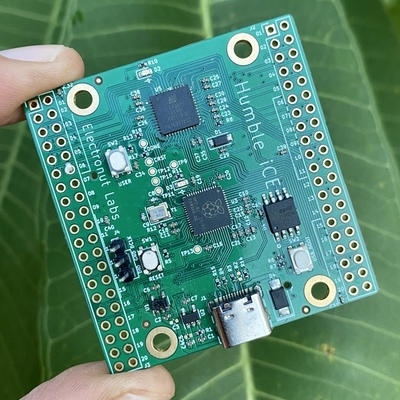
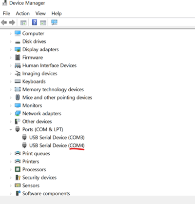

# Getting Started with Humble iCE



Thank you for purchasing Humble iCE! 

**Note:** If your RP2040 firmware is missing or needs to be re-uploaded, please 
read the [Customizing Humble iCE][2] document first.

To get started, you need to first clone this github repo on your computer, 
and cd into the *humble_ice* directory.

Next, let's make sure you can upload a bitstram to the board.

First make sure you have Python 3.x installed on your system. Next, 
install the [pyserial][1] module. 

## Linux 

Here are instructions for Linux. In this case, I tested with a Raspberry Pi 4
running Raspberry Pi OS.

*ssh* into your Pi and run this command:

```
dmesg -w
```

Now plug in Humble iCE into a USB port. You should see something like this:

```
[59592.185060] usb 1-1.4: Product: Humble iCE
[59592.185077] usb 1-1.4: Manufacturer: Electronut Labs
[59592.185094] usb 1-1.4: SerialNumber: 123456
[59592.268464] cdc_acm 1-1.4:1.0: ttyACM0: USB ACM device
[59592.271225] cdc_acm 1-1.4:1.2: ttyACM1: USB ACM device
```

The first port *ttyACM0* is what we need for uploading the bitstream.

Now run this from the shell:


```
python3 hiprog.py --p /dev/ttyACM0 --f bitstream/blinky.bin
```

Here's the output:

```
Starting serial_prog...
File size = 104090 bytes.
writing...
wrote 104090 bytes...
done.
```

If all went well, the red LED would have turned on briefly, and your blue LED 
has now started blinking at 1 Hz.

## Windows 10

Now for Windows. Bring up *Device Manager* and plug in your board.



There doesn't seem to be a consistent way to identify the first port on Windows. 
In my case *COM4* turned out to be one. In any case, it's easy enough to try both. 
Here's how you upload the bitstream:

```
python3 hiprog.py --p COM4 --f bitstream\blinky.bin
```

Note that depending on your setup, it can be *python* or *python3*.

Here's the output:

```
Starting serial_prog...
File size = 104090 bytes.
writing...
wrote 104090 bytes...
done.
```

Now you're ready to build your own FPGA projects.

## Building FPGA Projects 

The first step here is to install the amazing [OSS CAD suite][3] from YosysHQ. Go to their GitHub [releases][4] page and install the toolchain for your system.

I recommend that you install the OSS CAD suite on a Linux system (native, VM, or WSL on Windows). Once you can run *yosys* and *next-pnr* from a shell, you are ready to go. Also ensure that you can run *make* from your shell.

Now, cd to *examples/blinky* and type *make*. If all goes well, it will create a 
*blinky.bin* which you can upload to Humble iCE and get your first FPGA project going!

A lot more examples are coming, so keep an eye on this repo!


[1]: https://pyserial.readthedocs.io/en/latest/pyserial.html
[2]: https://github.com/mkvenkit/humble_ice/blob/main/customizing.md
[3]: https://www.yosyshq.com/open-source
[4]: https://github.com/YosysHQ/oss-cad-suite-build/releases

